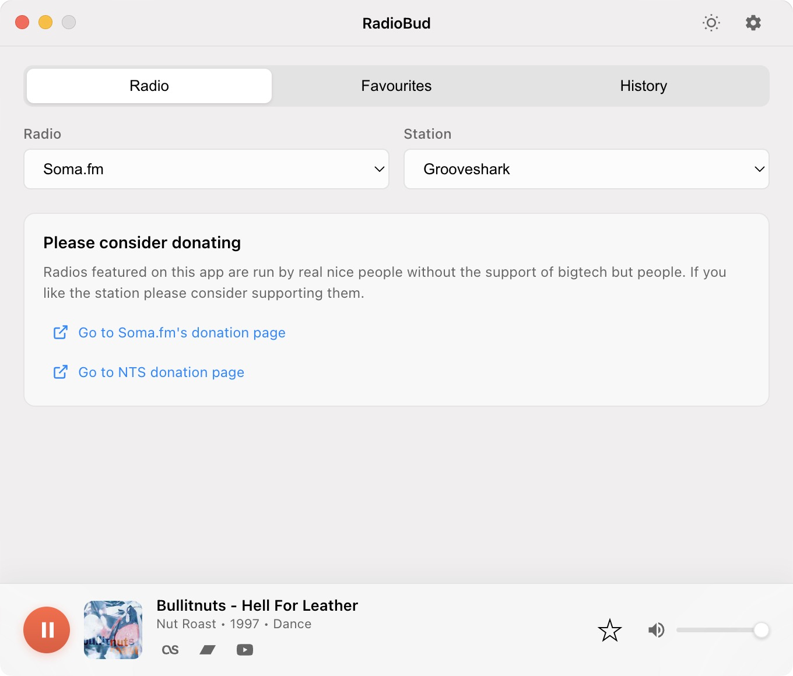

# RadioBud

A beautiful desktop radio app for streaming 36+ SomaFM stations with smooth cross-fading transitions and native macOS glass UI.



## Features

- Stream 36 SomaFM radio stations
- Smooth audio cross-fading (1000ms transitions)
- Real-time track information with iTunes metadata (album, year, genre)
- Album artwork with expandable view (works even without artwork)
- Song history tracking (last 100 songs)
- Favorites system with album art and service links
- Auto-stop playback when audio device changes
- Tabbed interface (Radio, History, Favorites)
- Service links: Last.fm, Bandcamp, YouTube search

## Installation

### Option 1: Download Pre-built App (Recommended)

Download the latest release from the [Releases](https://github.com/Lapin/RadioBud/releases) page.

### Option 2: Build from Source

1. Clone the repository:
   ```bash
   git clone https://github.com/Lapin/RadioBud.git
   cd RadioBud
   ```

2. Install dependencies:
   ```bash
   npm install
   ```

3. Run the app:
   ```bash
   npm start
   ```

## Building Executables

Create standalone executables for distribution:

```bash
# macOS
npm run build:mac        # Creates .app bundle
npm run build:mac:dmg    # Creates .dmg installer

# Windows
npm run build:win        # Creates .exe installer

# Linux
npm run build:linux      # Creates AppImage and .deb
```

Built apps will be in the `dist/` folder.

## Usage

- **Select Station**: Choose from 36 SomaFM stations in dropdown
- **Play/Stop**: Control playback with buttons
- **Volume**: Adjust with slider (0-100%)
- **Album Art**: Click to view expanded view with color-extracted gradient
- **Star Button**: Add current song to favorites
- **Tabs**: Switch between Radio, History, and Favorites
- **Service Links**: Quick access to Last.fm, Bandcamp, and YouTube for each track
- **Device Changes**: Playback automatically stops when switching audio outputs

## Album Artwork

RadioBud fetches album artwork automatically using a cascading fallback system:

1. **Primary**: iTunes Search API (no API key required)
2. **Fallback**: Last.fm API (uses public demo key, free & safe)
3. **Final**: "No Artwork" placeholder

> **Note**: The app works completely out of the box with no API key configuration needed. Album artwork is provided for free through iTunes and Last.fm public APIs.

## Tech Stack

- Electron
- HTML5 Audio API
- SomaFM Streaming API
- iTunes Search API (album artwork - no auth required)
- Last.fm API (album metadata fallback - free public key)

## License

ISC
